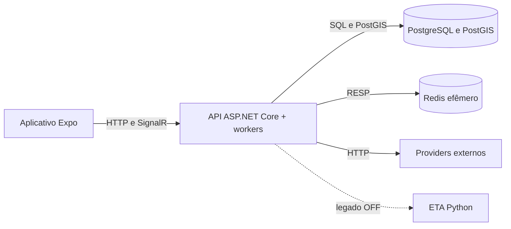

# NoPonto Backend

Backend do **NoPonto**, plataforma acadêmica de informação sobre mobilidade urbana desenvolvida no contexto de um Trabalho de Conclusão de Curso. Este repositório concentra estrutura de transporte, aquisição e tratamento de dados operacionais, APIs, processamento geoespacial, realtime e persistência utilizados pelo aplicativo móvel.

O núcleo vigente cobre ônibus, BRT e representação ferroviária. Rotas multimodais, Rotinas, notificações e metrô operacional permanecem planejados.

## Estado do projeto

| Área | Estado |
|---|---|
| Estrutura de transporte V2 versionada | operacional |
| GPS e matching de ônibus/BRT | operacional no backend |
| Redis, snapshots e SignalR | operacional; estado efêmero |
| Ferrovia schedule-first | operacional; posições inferidas, não GPS |
| Aplicativo mobile | implementado; build distribuído não confirmado nesta baseline |
| Telemetria e viagem operacional | implementadas |
| ETA legado | cliente fail-open presente; serviço Python desligado |
| ETA V2 | fundação experimental implementada; flags produtivas desligadas |
| POIs e tarifas | parciais, sem fluxo produtivo completo comprovado |
| Rotas, Rotinas, notificações e metrô | planejados |

## Funcionalidades principais

- Catálogo V2 de modais, linhas, sentidos, padrões operacionais, versões de percurso, paradas e ocorrências ordenadas.
- Importação estrutural com identidades externas, proveniência, hashes e publicação versionada.
- Coleta configurável de GPS de ônibus/BRT, validação, deduplicação e estado causal.
- Map matching em lote com PostgreSQL/PostGIS, continuidade, bearing, fração longitudinal e próxima ocorrência.
- Viagem operacional durável, passagens de parada, eventos e outbox.
- Snapshots Redis com TTL e CAS Lua, além de publicação SignalR por linha.
- Schedules ferroviários versionados, expected runs em memória, scanner limitado por budget, binding, tracker e estimativa temporal/espacial.
- Eventos de parada, histórico e telemetria para avaliação.
- Fundação ETA V2 com baseline/shadow/canary, persistência e ground truth, atualmente desabilitada em produção.

## Arquitetura

O backend é um **monólito modular em camadas**, não um conjunto de microsserviços. Controllers REST, SignalR e workers internos executam no mesmo processo ASP.NET Core.



- `1-API`: controllers, hubs, middleware e contratos de entrada HTTP.
- `2-Application`: regras, GPS, ferrovia, ETA, importações e BackgroundServices.
- `3-Domain`: entidades persistentes do domínio.
- `4-Data`: DbContext, interfaces, repositories e SQL/PostGIS.
- `5-Testes`: testes xUnit incorporados ao projeto.

Diagramas completos estão no [catálogo arquitetural](docs/07-diagramas/00-catalogo-convencoes-e-rastreabilidade.md).

## Tecnologias

- .NET 9, ASP.NET Core e C#.
- Entity Framework Core 9, Npgsql e NetTopologySuite.
- PostgreSQL 16 e PostGIS 3.4.
- Redis 7 e StackExchange.Redis.
- SignalR e Swagger/OpenAPI.
- Docker/Compose, GitHub Actions e GHCR.
- Frontend relacionado: Expo 55, React Native 0.83 e MapLibre GL JS em WebView.

## Fluxos resumidos

### Rodoviário

O collector consulta providers com janela e overlap, normaliza e deduplica observações. O polling aplica validação, matching PostGIS e correção causal. Posições aceitas atualizam Redis, viagem/outbox/telemetria conforme o estágio e são publicadas aos grupos SignalR.

### Ferroviário

Grades versionadas materializam viagens esperadas. Gate, sentinelas e budgets controlam consultas; evidências são associadas a expected runs e usadas para inferir progresso e posição sobre a geometria. O frontend recebe snapshots HTTP com origem, qualidade e idade.

### Persistência e ETA

PostgreSQL/PostGIS é a autoridade durável. Redis guarda projeções, locks, TTLs e streams, mas está configurado sem RDB/AOF e não deve ser tratado como backup. O ETA legado falha sem interromper GPS; ETA V2 permanece experimental e desligado.

## Estrutura do repositório

```text
noponto-backend/
├── .github/workflows/       # build e deploy
├── docs/                    # documentação técnica e acadêmica
├── NoPonto.sln
└── NoPonto/
    ├── 1-API/
    ├── 2-Application/
    ├── 3-Domain/
    ├── 4-Data/
    ├── 5-Testes/
    ├── Migrations/
    ├── Program.cs
    ├── Dockerfile
    └── docker-compose.yml
```

## Execução em desenvolvimento

### Pré-requisitos

- .NET SDK 9.
- PostgreSQL com PostGIS.
- Redis 7.
- Docker e Compose são opcionais para a infraestrutura local; o Docker Desktop local não representa a produção.

Defina variáveis de ambiente com valores próprios. Não versione `.env`, senhas, tokens ou connection strings. Categorias relevantes:

- `POSTGRES_*` e `REDIS_*`;
- `CORS__ORIGINS__*`;
- `GPS__*`, `GpsPolling__*` e seleção de sources;
- `TremRealtime__*` e `RailScheduleRuntime__*`;
- `EtaV2__*` e `TelemetriaMlSampling__*`;
- URLs e parâmetros dos providers estruturais.

Com PostgreSQL/Redis já disponíveis e a configuração preenchida:

```bash
dotnet restore NoPonto.sln
dotnet run --project NoPonto/NoPonto.csproj
```

Para usar o Compose local, revise primeiro o override e forneça todas as variáveis exigidas:

```bash
docker compose -f NoPonto/docker-compose.yml -f NoPonto/docker-compose.override.yml up -d
```

O override publica a API localmente em `5000:8080`. A URL criada pelo perfil `dotnet run` pode variar conforme `launchSettings.json`; consulte a saída da aplicação.

Migrations não são aplicadas automaticamente por este README. Execute-as somente em ambiente autorizado, após conferir alvo, backup e compatibilidade.

## API e Swagger

Swagger é exposto pela aplicação em `/swagger`; use a origem informada no startup. A superfície vigente inclui consultas estruturais V2, veículos, eventos de parada, snapshots ferroviários e contratos de compatibilidade necessários ao frontend. Controllers antigos de itinerários, POIs e administração estão total ou parcialmente excluídos da compilação e não devem ser usados como referência de API atual.

O ambiente observado não demonstrou autenticação/autorização suficiente para promover operações mutáveis como API pública. Consulte [segurança](docs/05-infraestrutura/06-seguranca-e-superficie-de-exposicao.md).

## Testes

O projeto possui testes xUnit unitários e de integração para estrutura V2, PostGIS, GPS, Redis, viagem, ferrovia, telemetria e ETA. Alguns testes exigem dependências descartáveis ou configuração específica.

```bash
dotnet test NoPonto.sln
```

O comando não foi executado durante a atualização deste README. Antes de rodar, confira filtros, requisitos de PostgreSQL/Redis e isolamento; não direcione testes de integração à produção.

## Build e deploy

O workflow backend constrói imagem `linux/amd64` com Buildx e publica no GHCR como `latest`, tag temporal com SHA curto e `build-N`. O deploy ocorre somente por execução manual do workflow, via rede privada e script remoto. O Compose produtivo usa `latest`; pin por digest, smoke test e rollback automatizado não foram comprovados.

## Documentação

A [documentação completa](docs/README.md) reúne auditoria, projeto, arquitetura, fluxos, modelagem, infraestrutura, roadmap, diagramas e material acadêmico do TCC.

## Limitações conhecidas

- Redis operacional sem persistência em disco.
- API e workers compartilham recursos no mesmo processo.
- Backup/restore, RPO/RTO e observabilidade centralizada ainda não comprovados.
- Rastreabilidade produtiva prejudicada pelo uso de tag mutável.
- Segurança de portas, Docker socket e endpoints requer estabilização.
- Resultados quantitativos de matching, ferrovia e ETA dependem de protocolo consolidado.

## Autoria e licença

Projeto acadêmico NoPonto. Não foi identificado arquivo de licença nesta baseline; nenhum direito de reutilização deve ser presumido sem autorização do responsável pelo projeto.
