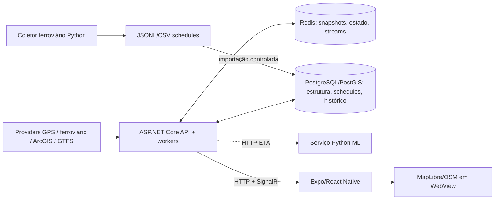

# 04 — Mapa de arquitetura

**Data:** 2026-10-06 · **Commits:** backend `53567bd`, frontend `c69a92e`, ML `08c493b` · **Estado:** código verificado; implantação parcial confirmada

## Visão funcional

O aplicativo consulta estrutura e snapshots por HTTP, recebe posições rodoviárias pelo hub SignalR e obtém snapshots ferroviários estimados. A API adquire dados externos, enriquece-os com estrutura geoespacial, mantém estado operacional no Redis e persiste histórico/estrutura no PostgreSQL/PostGIS.

## Componentes backend

- **API:** controllers V2, tarifas, veículos, eventos e rail snapshot; middleware global de exceções; Swagger.
- **Aquisição:** `GpsSppoCollectorService`, `GpsPollingService`, `GpsBrtClient`, `GpsDatarioClient`, `TrensRjClients`.
- **Processamento rodoviário:** validação, resolução de fonte, correção temporal, matching PostGIS, projeção operacional, ETA shadow.
- **Ferrovia:** normalização, lookup estrutural, schedule gate/cache, expected-run binding, tracker, scanner adaptativo e estimador espacial/temporal.
- **Persistência:** EF Core para estrutura/schedules; Npgsql/SQL especializado para operações em lote; Redis para estado efêmero.
- **Distribuição:** REST e `GpsHub` SignalR.

## Fronteiras e protocolos

| Comunicação | Protocolo | Estado |
|---|---|---|
| App ↔ API | HTTPS/HTTP JSON; SignalR WebSocket/fallback | implementado; TLS externo não verificado |
| API ↔ PostgreSQL | PostgreSQL TCP/Npgsql | produção confirmada |
| API ↔ Redis | RESP/StackExchange.Redis | produção confirmada |
| API ↔ ML | HTTP JSON | código implementado; destino parado |
| API ↔ providers | HTTPS/JSON | implementado; disponibilidade dependente de terceiros |
| Extrator ↔ provider | HTTP com checkpoint/rate control | local/experimental |

## Decisões observáveis

PostGIS concentra geometria, índices GIST e matching set-based; Redis reduz latência de snapshots e coordena estado causal; SignalR distribui atualizações; ferrovia adota schedule-first porque a fonte não fornece GPS confiável; ML foi separado por linguagem/runtime. Motivações históricas exatas não foram encontradas e devem ser tratadas como hipótese técnica, não fato histórico.

## Diagramas possíveis na Etapa 2

C4 contexto/container/componentes, implantação, ER, sequência GPS, sequência ferroviária e ETA já têm material. Diagrama de estados ferroviário exige validar nomenclatura final de confiança. Rotas/rotinas multimodais dependem de requisitos ainda não consolidados.

## Referências

`Program.cs`; `4-Data/Context/DbContext.cs`; `2-Application/Services/GPS`; `2-Application/Services/TremRealtime`; frontend `src/services` e `src/components/mapOSM`; Compose local e produção.
