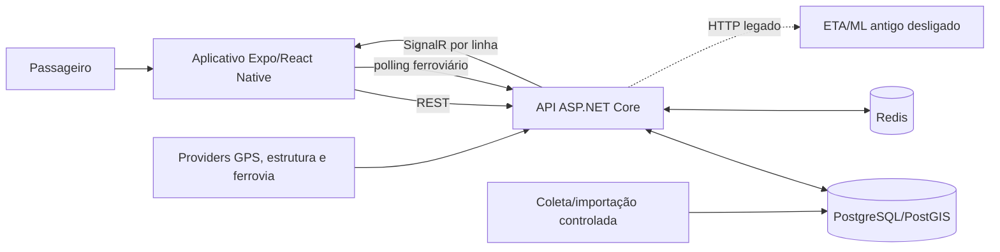

# NoPonto — arquitetura geral

**Finalidade:** explicar a organização funcional, lógica e física do sistema e fornecer nomes consistentes para futuros diagramas.  
**Data:** 2026-10-06 · **Baseline:** backend `53567bd`; frontend `c69a92e`; ML `08c493b`  
**Verificação:** código e produção reconciliados; frontend publicado não verificado.

## Visão funcional

O passageiro interage com um aplicativo mobile para pesquisar linhas, selecionar percursos, visualizar paradas ou estações e acompanhar veículos. O aplicativo não consulta os operadores diretamente: o backend integra e normaliza fontes externas, associa observações à estrutura de transporte e entrega contratos estáveis ao cliente.

Para ônibus e BRT, a informação operacional parte de coordenadas GPS observadas. Para trem, o sistema combina schedules e evidências externas para estimar posição. A arquitetura compartilha conceitos estruturais — linha, sentido, percurso e parada — mas não força a mesma estratégia operacional sobre todos os modais.

## Classificação arquitetural

O NoPonto é uma **aplicação distribuída em camadas, com backend modular e processamento assíncrono hospedado no processo da API**. Não é correto classificá-lo como arquitetura de microsserviços: controllers, regras GPS, runtime ferroviário, workers e acesso a dados são compilados no mesmo projeto e executados no mesmo container/processo. PostgreSQL, Redis, aplicativo e o serviço ML legado são processos externos, mas isso não transforma cada módulo interno em serviço independente.

Há características inspiradas em arquitetura em camadas e modelagem de domínio: API, Application, Domain e Data; interfaces/repositórios; entidades e serviços. Entretanto, dependências práticas e SQL especializado atravessam fronteiras, e não há evidência para afirmar conformidade integral com Clean Architecture ou DDD.

## Arquitetura lógica

| Responsabilidade | Componentes principais | Entrada | Saída/consumidor |
|---|---|---|---|
| Aquisição rodoviária | clients/adapters, coletor e polling GPS | JSON de providers | observação normalizada |
| Validação temporal | validator, estado causal, correção temporal | observações | leituras aceitas/rejeitadas |
| Matching geoespacial | enriquecimento e repositórios PostGIS | posição + estrutura V2 | padrão/versão, progresso e próxima ocorrência |
| Estado operacional | viagem observada, Redis, outbox | posição enriquecida | snapshot, viagem e eventos |
| Estrutura V2 | importadores, reconciliação, entidades e leitura V2 | GTFS/ArcGIS/recursos | catálogo versionado |
| Ferrovia | schedule, expected runs, scanner, binding, tracker e estimator | grade + evidências | snapshot com origem/qualidade |
| ETA/telemetria | cliente legado, telemetria e ETA V2 shadow | posição/viagem | ETA legado opcional; eventos V2 |
| Distribuição | controllers e `GpsHub` | DTOs internos | REST/SignalR |
| Interface | services, hooks, telas e MapLibre | contratos API | mapa e interação do passageiro |

## Estado e persistência

PostgreSQL/PostGIS é a fonte durável para estrutura, schedules, relações, histórico, telemetria e eventos de avaliação. Redis mantém dados operacionais de curta duração: snapshots por veículo, índices por linha, estado causal e streams. Essa divisão evita usar o banco relacional como cache de baixa latência e impede tratar Redis como fonte definitiva de estrutura.

O aceite temporal no Redis antecede viagem, telemetria e broadcast. Se a gravação falha, a posição não avança como se tivesse sido confirmada. TTLs distinguem posição ativa e recente; a indisponibilidade do Redis afeta o realtime, mesmo que a estrutura durável continue no PostgreSQL.

## Arquitetura física

- aplicativo Expo/React Native executado no dispositivo;
- API .NET 9 em container Linux;
- PostgreSQL 16/PostGIS 3.4 em container com volume;
- Redis 7 em container, estado operacional efêmero;
- serviço FastAPI ETA/ML antigo, container intencionalmente desligado;
- providers externos acessados por HTTP(S);
- MapLibre e ícones carregados pela WebView a partir de CDN;
- servidor Debian com Docker Compose e imagens GHCR.

API, PostgreSQL e Redis compartilham a rede Compose. Workers não possuem endpoint/processo próprio: são `BackgroundService` do container API e usam DI para acessar serviços/repositórios.

## Fronteiras e protocolos

| Fronteira | Protocolo | Observação |
|---|---|---|
| app → API | HTTP JSON | estrutura, eventos, veículos e ferrovia |
| API → app rodoviário | SignalR/WebSocket com fallback | grupos por código de linha |
| app → API ferroviária | HTTP polling | snapshot periódico; geometria hidratada separadamente |
| API → providers | HTTP(S)/JSON ou arquivos GTFS | budgets, timeout e normalização variam |
| API → PostgreSQL | protocolo PostgreSQL via EF/Npgsql | EF para modelo; SQL direto para hot paths/batches |
| API → Redis | RESP via StackExchange.Redis/cache abstractions | snapshot, CAS, TTL e streams |
| API → ETA antigo | HTTP JSON | timeout curto e fail-open; destino desligado |
| React Native ↔ WebView | JavaScript injetado e `postMessage` | fronteira do mapa |

## Arquitetura vigente, transição e futuro

- **Vigente:** estrutura V2, GPS/matching, Redis/SignalR, ferrovia schedule-first, frontend MapLibre.
- **Transição:** ETA antigo versus ETA V2; DTO SignalR e fachada de mapas/detalhes; configuração legada.
- **Futuro:** metrô, Rotinas, grafo/rotas multimodais, notificações e ML supervisionado V2.

## Preparação para diagramas

O C4 Context deve mostrar passageiro, NoPonto e providers. O C4 Container deve separar app, API, PostgreSQL/PostGIS, Redis e ETA legado; workers permanecem dentro da API. O C4 Component do backend pode usar os subsistemas da tabela lógica. Sequências posteriores devem respeitar API/Redis como intermediários e distinguir SignalR rodoviário de polling ferroviário.

## Limitações e documentos relacionados

A correspondência binária imagem↔commit não possui label de revisão; o frontend distribuído não foi inspecionado; qualidade/latência não são afirmadas. Detalhes: [componentes](03-componentes-backend-frontend.md), [comunicação](05-contratos-e-comunicacao.md), [decisões](06-decisoes-arquiteturais.md) e [implantação](07-arquitetura-de-implantacao.md).

## Evidências e pendências

`Program.cs`, `.csproj`, services/repositories, frontend `src`, Compose e auditorias 14/15. Pendente: confirmar build mobile e associar imagens a commit por metadata.
