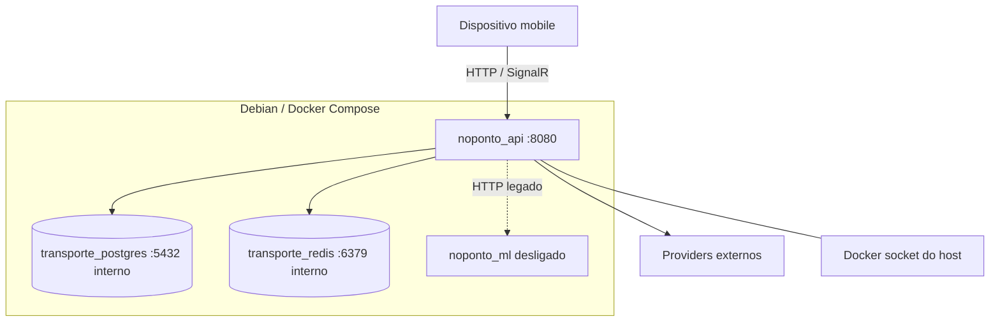

# NoPonto — arquitetura de implantação

**Finalidade:** descrever ambientes, containers, redes e fluxo de build/deploy no nível necessário à arquitetura global.  
**Data:** 2026-10-06 · **Baseline:** backend `53567bd`; frontend `c69a92e`; ML `08c493b`  
**Verificação:** workflows/Compose e fotografia read-only de produção; operação detalhada fica para Etapa 2.4.

## Ambientes

- **Desenvolvimento local:** repositórios Windows; Docker Desktop desligado e não usado como referência.
- **CI:** GitHub Actions em runners Ubuntu; build de imagem API e APK Expo/EAS.
- **Produção:** servidor Debian 12 com Docker Engine/Compose; stack NoPonto em rede própria.
- **Externos:** providers HTTP, GHCR, EAS/CDNs e dispositivo do passageiro.

## Topologia produtiva

API, banco e Redis pertencem à rede `noponto_default`. Portas observadas eram publicadas também no host: API 8080, PostgreSQL 5432 e Redis 6380→6379. Exposição, firewall e TLS serão tratados na Etapa 2.4. O Docker socket é montado na API, um acoplamento privilegiado que não é necessário para explicar o fluxo do passageiro, mas é relevante à segurança.

## Containers atuais

| Container | Papel | Estado observado |
|---|---|---|
| `noponto_api` | API e todos os workers internos | ativo; imagem GHCR `latest` |
| `transporte_postgres` | PostgreSQL/PostGIS durável | ativo/healthy, volume externo |
| `transporte_redis` | estado operacional | ativo/healthy, limite de memória e volume |
| `noponto_ml` | ETA antigo | desligado intencionalmente durante migração |
| `noponto_v24_postgres` | legado provável | parado; fora da arquitetura vigente |

Stacks `auth-*`, Portainer e Dozzle compartilham o servidor, mas não são containers funcionais do NoPonto nesta baseline.

## Build da API

O Dockerfile usa multi-stage: SDK .NET 9 restaura/publica; imagem runtime ASP.NET 9 executa `NoPonto.dll` na porta 8080. O workflow em push para `main` autentica no GHCR e publica três tags: `latest`, timestamp+short SHA e número do build. Buildx usa cache GHA e plataforma `linux/amd64`.

O Compose referencia `latest`. Embora tags imutáveis sejam produzidas, a implantação observada não fixa digest/tag versionada no arquivo; a imagem produtiva não carrega label Git que prove o commit. Isso limita rastreabilidade e rollback.

## Deploy backend

Deploy é condicionado a `workflow_dispatch`, após build. O runner conecta à rede privada, copia o Compose e executa script remoto para atualizar o serviço API. Segredos ficam no GitHub Actions e não são documentados. O comportamento interno do script de deploy/rollback não foi auditado.

## Build mobile

O workflow frontend usa Node 22, pnpm 10 e EAS `latest`, instala lockfile e executa build Android com perfil `preview`, produzindo APK. Não há etapa de teste/lint no workflow examinado nem confirmação do artefato instalado/publicado. iOS não é construído nesse pipeline.

## Configuração e comunicação

Variáveis de ambiente configuram banco, Redis, providers, cadências e feature flags. Valores secretos não pertencem à documentação. Healthchecks existem para PostgreSQL/Redis; não foi identificado healthcheck formal da API no Compose. Workers iniciam com o processo API conforme DI/opções. ETA V2 permanece registrado, mas flags desligam produção/shadow.

## Persistência

PostgreSQL usa volume externo e é a base durável. Redis possui volume, mas o comando desabilita RDB/AOF; o conteúdo deve ser tratado como reconstruível/efêmero. Backup, restore, retenção, capacidade e RPO/RTO não são detalhados aqui.

## Limitações e riscos arquiteturais

- processo API único reúne HTTP e workers;
- tag `latest` dificulta reprodução, apesar das tags versionadas disponíveis;
- ausência de metadata de commit na imagem;
- healthcheck API e rollback não comprovados;
- serviço ML legado continua na configuração;
- portas e Docker socket exigem hardening;
- build mobile não comprova distribuição.

## Preparação para diagrama de implantação

Nós: dispositivo, host Debian, rede Compose, API, PostgreSQL/PostGIS, Redis e ML desligado. Artefatos: APK e imagem GHCR. Relações: HTTP/SignalR, PostgreSQL, RESP, HTTP externo e pipeline CI→registry→host. Workers devem aparecer dentro do nó API.

## Evidências, relacionados e pendências

`Dockerfile`, `docker-compose.yml`, workflows e auditorias [07](../00-auditoria/07-infraestrutura-producao.md)/[15](../00-auditoria/15-reconciliacao-producao-e-contexto.md). Pendente: pin de imagem, label OCI revision, healthcheck, rollback, build mobile verificável e documentação operacional 2.4.
