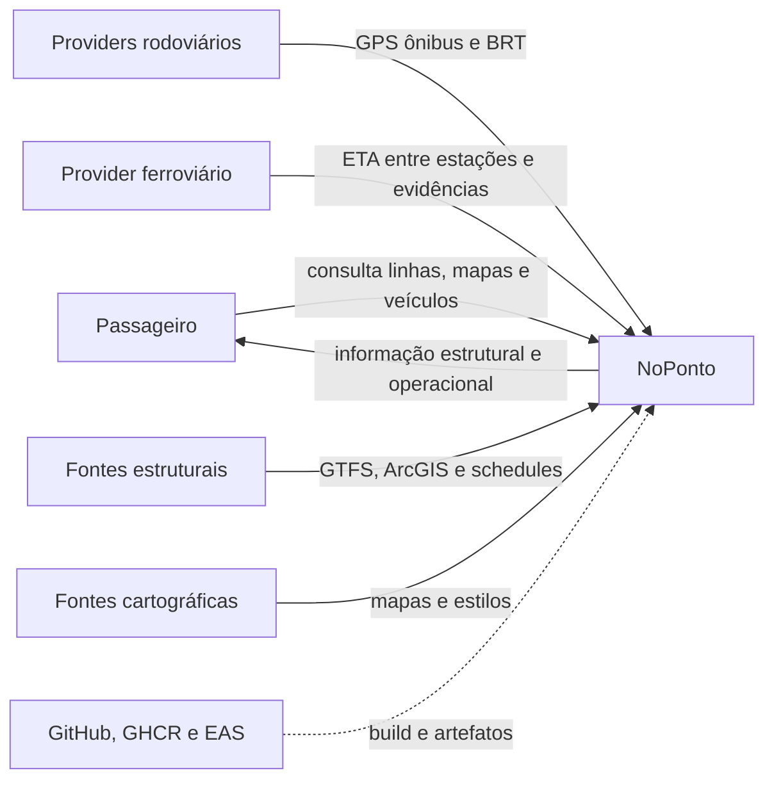

# C4 — contexto do NoPonto

**Objetivo:** situar passageiro, NoPonto e fontes externas. **Nível:** C4 Contexto. **Baseline:** 2026-10-06.

**Participantes/relações:** o passageiro usa o produto; providers entregam dados heterogêneos; fontes estruturais alimentam importações; cartografia sustenta visualização; serviços de build não são parte funcional. PostgreSQL/Redis ficam fora deste nível.

**Fonte:** arquitetura 02, integrações externas e código de clients. **Limitações:** metrô, Rotas e Rotinas não aparecem porque são planejados; painel admin está fora do escopo. **Uso na monografia:** visão inicial do sistema e fronteiras externas.
