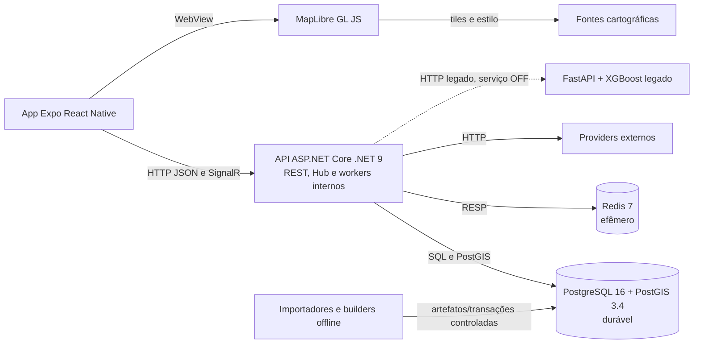

# C4 — containers e responsabilidades

**Objetivo:** mostrar unidades executáveis/de dados sem chamar o monólito de microsserviços. **Nível:** C4 Container. **Baseline:** 2026-10-06.

**Relações:** API concentra controllers, Hub e BackgroundServices; PostgreSQL é autoridade durável; Redis mantém projeções/streams sem RDB/AOF; ML antigo está desligado. Ferramentas offline não são serviços permanentes.

**Fonte:** Dockerfile, Compose, Program e frontend. **Limitações:** publicação de portas e ferramentas do host aparecem em 05; ETA V2 fica dentro da API. **Uso:** capítulo de arquitetura lógica.
