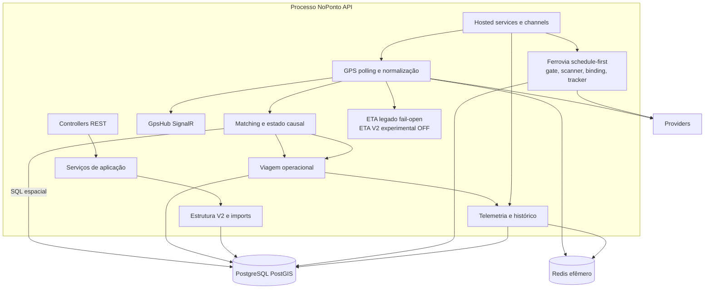

# Componentes do backend

**Objetivo:** decompor a API modular e seus fluxos principais. **Nível:** componentes. **Baseline:** 2026-10-06.

REST, GPS, ferrovia e workers compartilham processo, CPU, memória, pools e falha. Camadas `1-API`, `2-Application`, `3-Domain` e `4-Data` organizam responsabilidades, mas não são unidades de deploy.

**Fonte:** Program, services/repositories e [componentes](../02-arquitetura/03-componentes-backend-frontend.md). **Limitações:** classes auxiliares foram agrupadas; flags determinam execução. **Uso:** implementação e trade-off do monólito modular.
