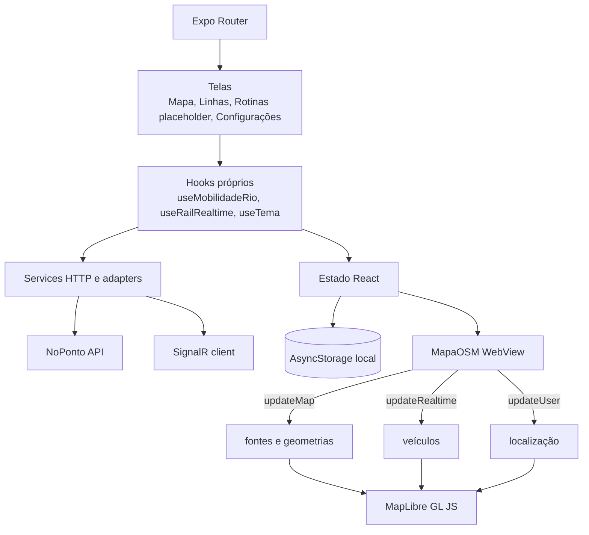

# Componentes do frontend

**Objetivo:** explicar telas, estado e ponte React Native–WebView. **Nível:** componentes. **Baseline:** frontend `c69a92e`.

React Native cria a WebView e envia atualizações incrementais; o script mantém sources/layers/animação. SignalR atende rodoviário; polling atende ferrovia. TanStack Query está instalado, mas não participa dos fluxos vigentes. AsyncStorage não sincroniza entre dispositivos.

**Fonte:** `app/`, hooks/services e WebView. **Limitações:** Rotinas é placeholder; POIs são incompletos; build distribuído não verificado. **Uso:** capítulo mobile e separação dos dois runtimes.
