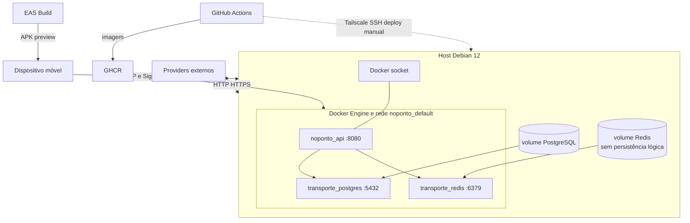

# Implantação e comunicação

**Objetivo:** representar produção e cadeia de artefatos sem inventar proxy/TLS/firewall. **Nível:** implantação. **Baseline:** fotografia 2026-10-06.

Portas API, PostgreSQL e Redis estavam publicadas no host; alcance externo, TLS, firewall e reverse proxy não foram confirmados. Redis possui volume, mas RDB/AOF estão desabilitados. Portainer/Dozzle e stacks externas são compartilhados, não componentes funcionais.

**Fonte:** Compose/workflows e infraestrutura 05. **Limitações:** medição pontual; topologia pública não inferida. **Uso:** implantação, riscos e capacidade.
