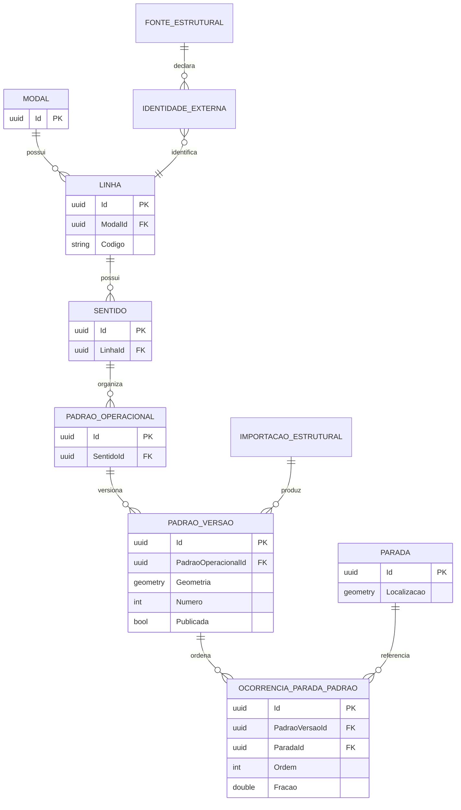

# DER — estrutura de transporte V2

**Objetivo:** explicar identidade estável, versão e ocorrências. **Nível:** lógico/físico resumido. **Baseline:** migrations até a baseline.

Uma parada física pode ocorrer várias vezes no padrão; por isso ocorrência, ordem e versão são indispensáveis. `PadraoOperacional` é identidade estável e `PadraoVersao` preserva mudanças de geometria. Proveniência/importação foi simplificada; algumas identidades externas são polimórficas e não formam FK física única como sugeriria um DER ingênuo.

**Fonte:** DbContext, migrations e [estrutura V2](../04-dados/03-estrutura-v2-identidades-e-versionamento.md). **Limitações:** campos secundários omitidos. **Uso:** modelagem e justificativa de versionamento.
