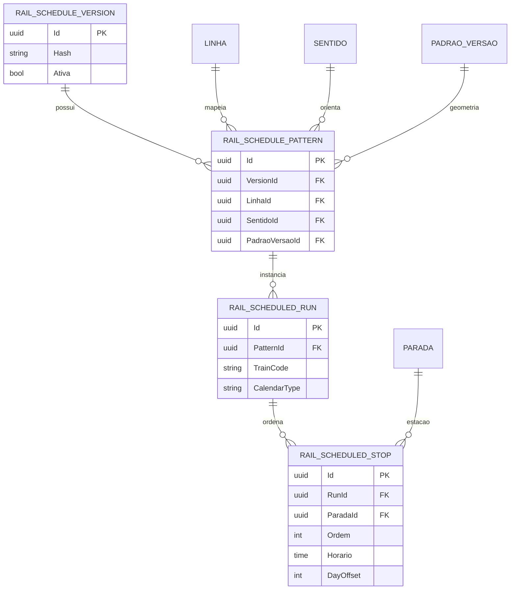

# DER — ferrovia e schedules

**Objetivo:** separar grade persistida de estado runtime. **Nível:** lógico. **Baseline:** 2026-10-06.

ExpectedRun, binding, tracker, sentinelas e estimativas são objetos em memória, não tabelas. A ativação da versão seleciona grade vigente; calendário materializa runs esperadas por data.

**Fonte:** entidades/migration RailScheduleFoundation e [modelagem ferroviária](../04-dados/04-modelagem-ferroviaria-e-schedules.md). **Limitações:** nomes/atributos resumidos; feriado não possui regra operacional completa comprovada. **Uso:** capítulo ferroviário e prevenção de confusão entre grade e inferência.
