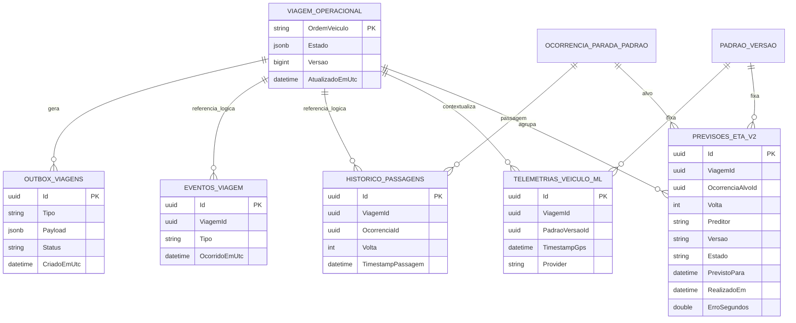

# DER — viagens, histórico, telemetria e ETA

**Objetivo:** mostrar persistência operacional e identidades de avaliação. **Nível:** físico resumido, com referências lógicas marcadas. **Baseline:** 2026-10-06.

`ViagensOperacionais.Estado` guarda agregado JSON; algumas relações acima são identidades dentro de payload/colunas e não FKs em todos os casos. A previsão usa viagem + versão + ocorrência + volta para evitar fechar contra visita errada. Ground truth pode ser interpolado; sua qualidade não tem campo explícito.

**Fonte:** migrations de viagem/outbox, telemetria e ETA; [dados operacionais](../04-dados/05-viagens-historico-telemetria-e-eta.md). **Limitações:** conferir nome/constraint na migration antes de publicar figura física final. **Uso:** persistência, outbox e avaliação ETA.
