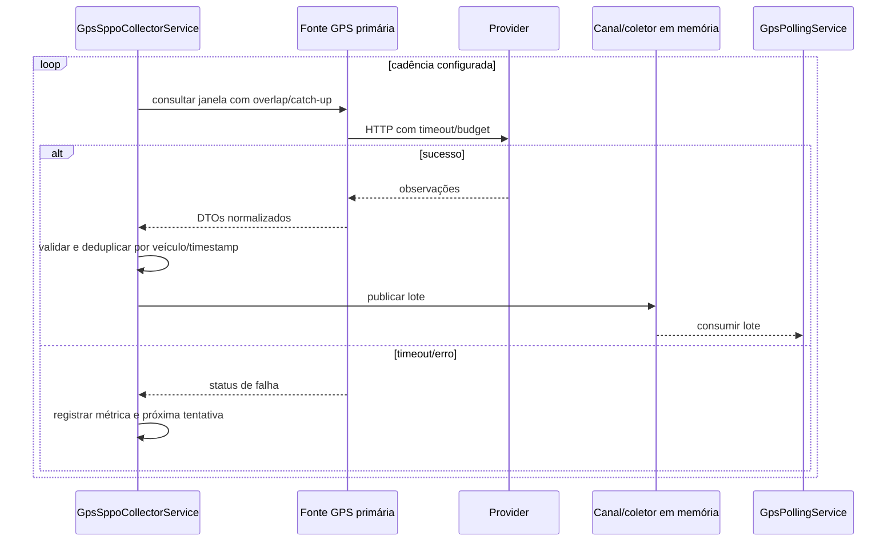
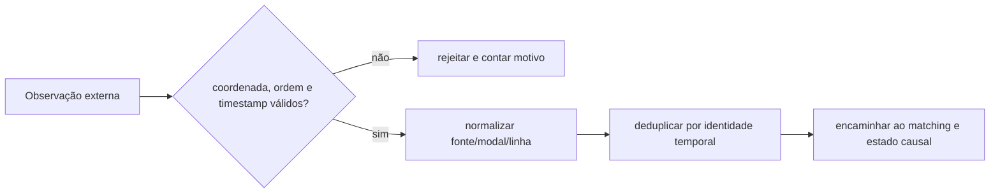

# GPS — polling, aquisição e normalização

**Objetivo:** representar provider até lote normalizado. **Nível:** sequência/atividade. **Baseline:** 2026-10-06.

**Participantes:** collector/client/provider/channel/polling. **Fonte:** `GpsSppoCollectorService`, sources e validators. **Limitações:** valores de janela são configuráveis; shadows comparam fontes, não provam fallback. **Uso:** seção de aquisição GPS.
