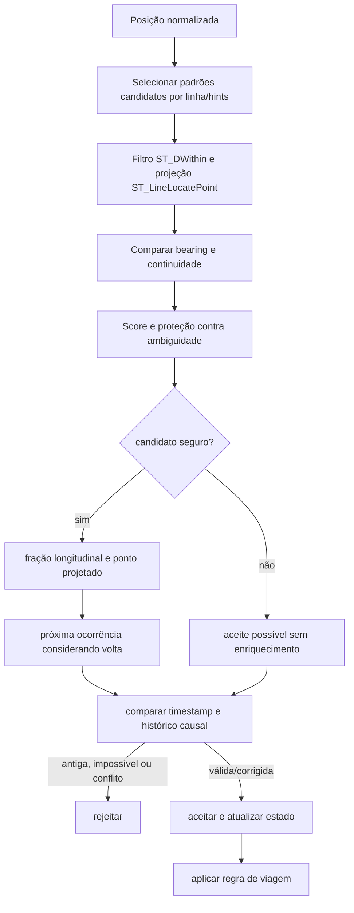
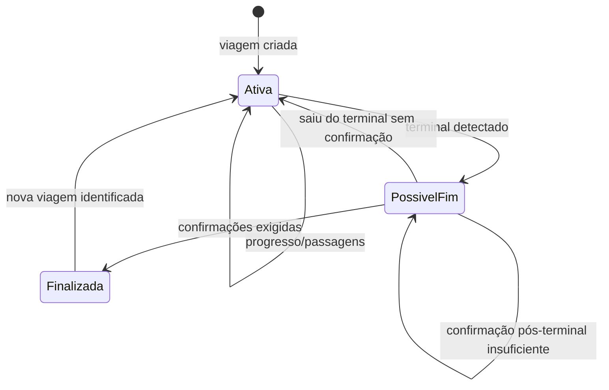

# Matching, estado causal e viagem operacional

**Objetivo:** integrar decisão espacial, correção temporal e ciclo de viagem. **Nível:** atividades/estados. **Baseline:** 2026-10-06.

O matching combinado é set-based quando flag habilitada. A viagem fixa `PadraoVersao`, emite passagens idempotentes e não regride por jitter. A transição pós-finalização cria/reconhece nova viagem segundo identidade/estrutura; a figura resume condições, não substitui `ViagemOperacionalRegra`.

**Fonte:** repositories PostGIS, correção temporal e `ViagemOperacional.cs`. **Limitações:** thresholds/configurações omitidos; match inconclusivo não é posição falsa. **Uso:** algoritmo rodoviário e máquina de estados.
