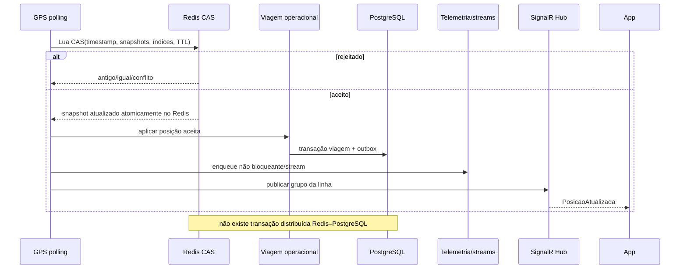
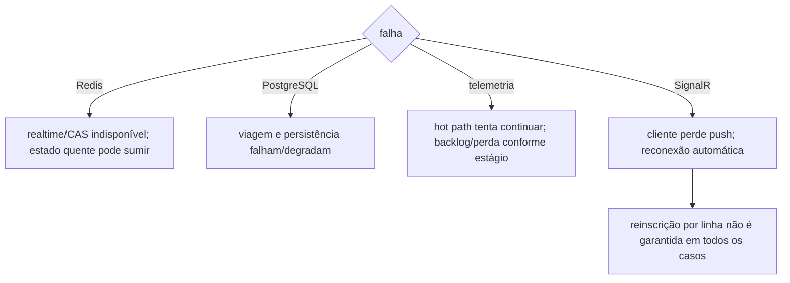

# Redis, SignalR e consistência operacional

**Objetivo:** mostrar aceite, efeitos secundários e ausência de transação distribuída. **Nível:** sequência/recuperação. **Baseline:** 2026-10-06.

Redis é localmente atômico pelo script, mas sem RDB/AOF. Outbox protege efeitos PostgreSQL posteriores, não sincroniza Redis. **Fonte:** repository cache/Lua, polling, outbox e Hub. **Limitações:** ordem entre efeitos é abstraída; recovery não foi testada ponta a ponta. **Uso:** consistência, falhas e trade-offs.
