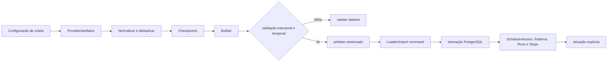
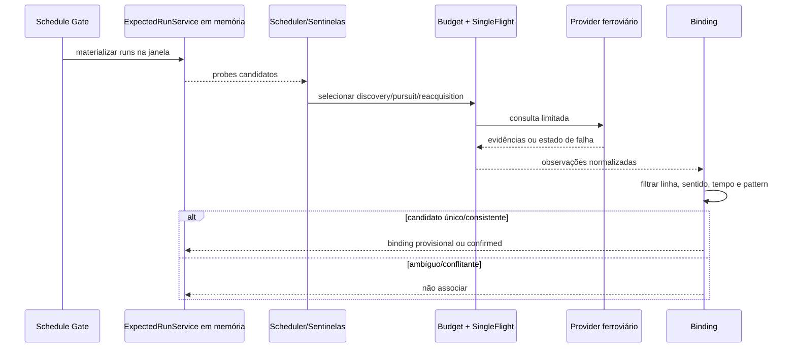

# Ferrovia — coleta, importação, scanner e binding

**Objetivo:** representar preparação offline e aquisição runtime. **Nível:** atividades/sequência. **Baseline:** 2026-10-06.

Expected runs/bindings são memória reconstruível. Scanner usa gate, sentinelas, discovery, pursuit, backoff e reacquisition para limitar requests. **Fonte:** Schedule services e TremRealtime. **Limitações:** coleta offline possui ferramentas/artefatos externos; feriados incompletos. **Uso:** pipeline ferroviário antes da inferência.
