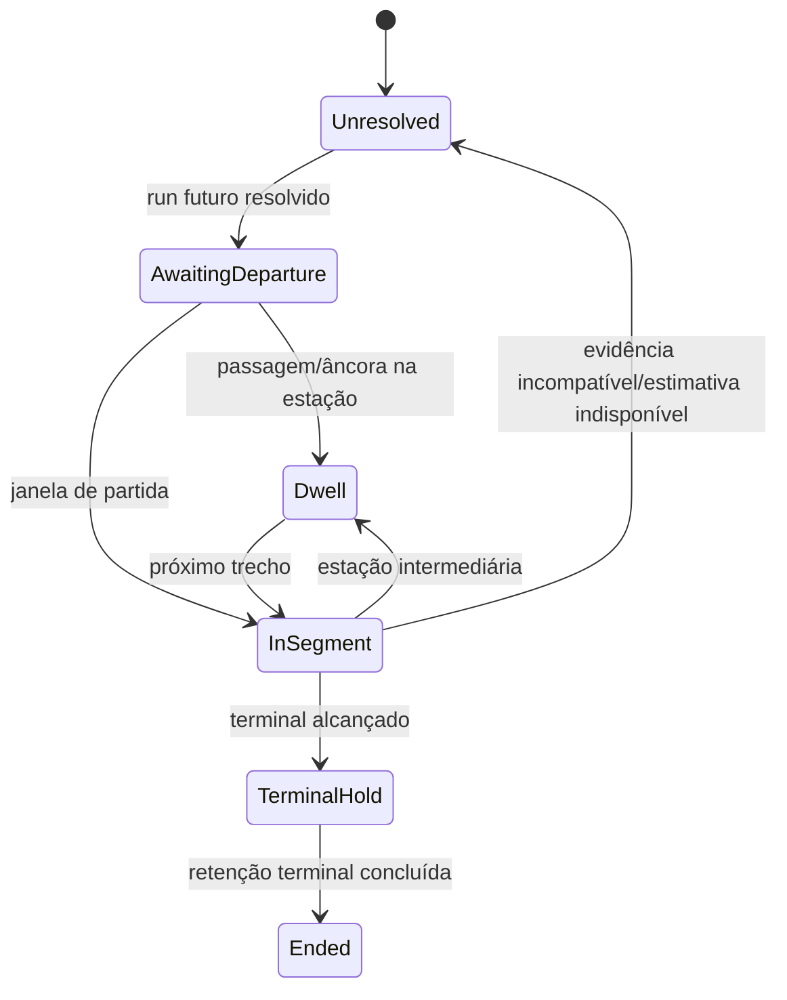
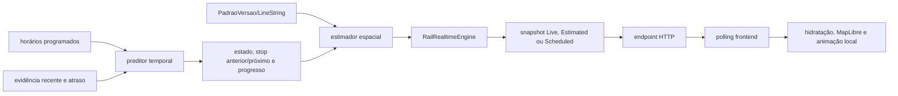

# Ferrovia — predição, estados e publicação

**Objetivo:** mostrar estados confirmados e transformação schedule/evidência em posição inferida. **Nível:** estados/fluxo. **Baseline:** 2026-10-06.

Em paralelo, o tracker de evidências usa `New → Active → Stale`; o coordenador adaptativo usa `Discovery`, `Acquisition`, `Tracked` e `Reacquisition`. São máquinas distintas e não foram fundidas. Qualidade/origem acompanham posição; freshness impede extrapolação indefinida.

**Fonte:** `RailRealtimeModels`, tracker, estimator/engine e frontend. **Limitações:** algumas transições dependem de condições compostas; posição é inferência. **Uso:** explicar “realtime ferroviário” sem sugerir GPS.
