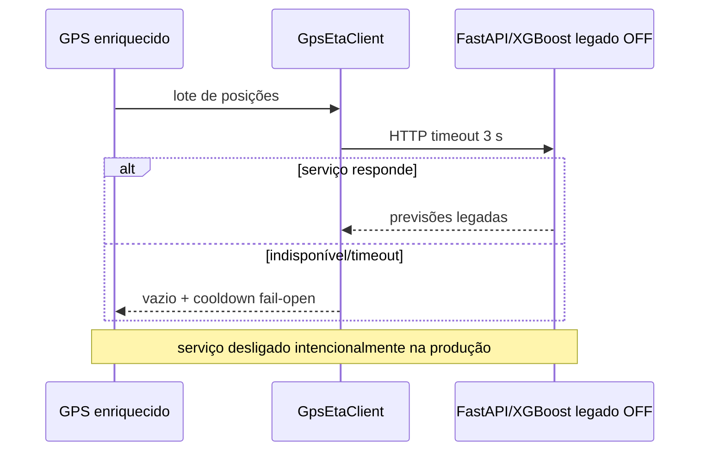
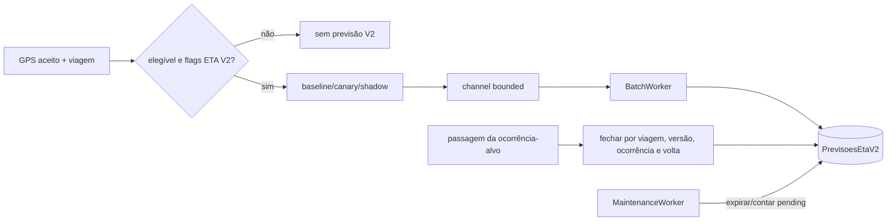
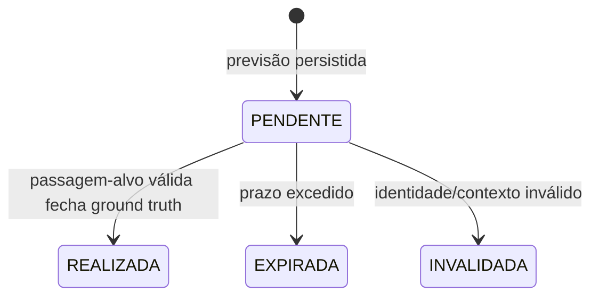
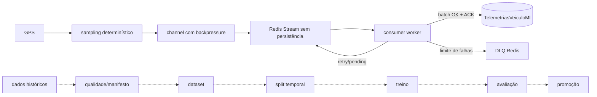

# ETA, telemetria, ground truth e ML

**Objetivo:** separar legado, fundação V2 e pipeline supervisionado planejado. **Nível:** sequência/estado/dados. **Baseline:** ETA V2 OFF em produção.

O último encadeamento é planejado, não pipeline supervisionado integral. Redis restart pode perder stream/pending/DLQ. **Fonte:** GpsEtaClient, EtaV2*, TelemetriaMl* e docs 13–19. **Limitações:** transições ETA devem ser confirmadas por testes ao publicar resultados; ground truth pode ser interpolado. **Uso:** evolução ML e rigor experimental.
