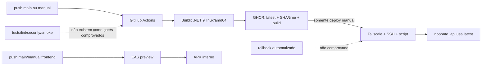
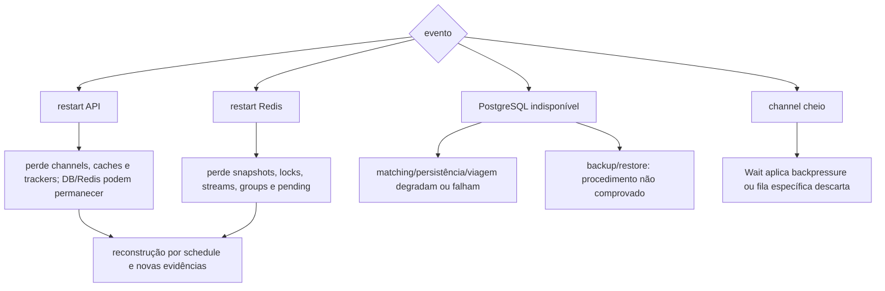

# CI/CD, armazenamento e recuperação

**Objetivo:** unir cadeia de build e fronteiras reais de recuperação. **Nível:** fluxo de implantação/estado. **Baseline:** 2026-10-06.

PostgreSQL/volume são duráveis, mas volume não é backup. Outbox é transacional no banco; não há transação distribuída. **Fonte:** workflows, Compose e docs 05/07. **Limitações:** script remoto, restore, RPO/RTO e smoke test não verificados. **Uso:** implantação, confiabilidade e limitações.
